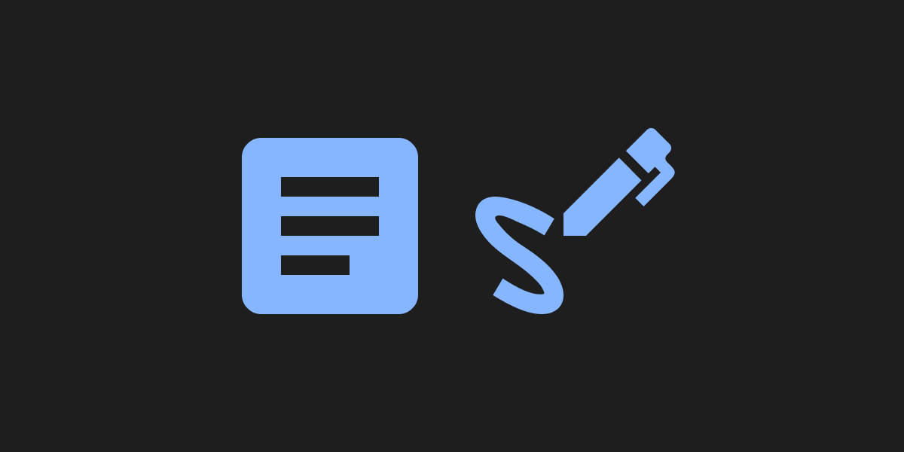
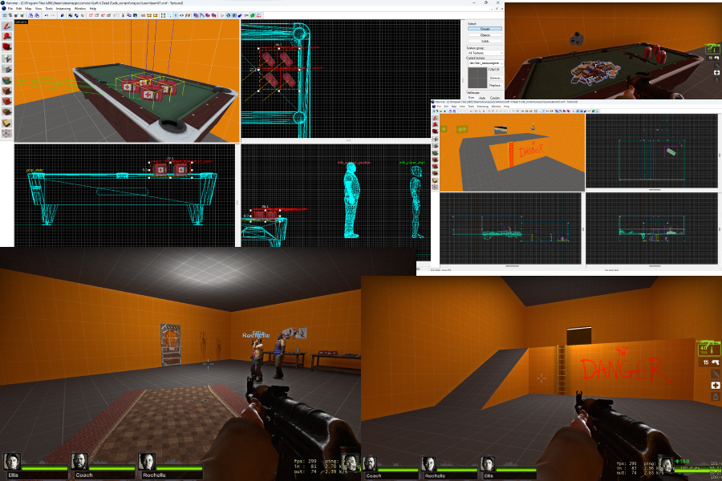

## Introduction
Welcome to my personal blog! I am beginner tech blogger and this is my first blog post. In this article I want to write about the future plans and reasons why I want to blog.

## Little about me
My name is Michał, and I am 19yo from Poland. I started with programming in 2018 and my first programming language was JavaScript. I’m interested in backend development, operating systems (like Linux) and I support open-source-software movement.

Besides programming, I also like video games. I don't only play them, but also I try to create content for them. Recently I started learning map making for games like *Left 4 Dead*, *Half-Life* and *Garry's Mod*. It's nice that I can apply my programming skills in writing scripts.

In short, I just love to create things.

## Reasons to blog
My blog is part of my personal experiment (I will explain more in future content). I do not think I will achieve big audience. I want small place to express myself.

Besides need of my own space I also want to level-up my english skills. Currently, I feel my english skill requires serious improvements and work. I hope progress will be visible with every new article.

Blogging also will push me to research new interesting topics. I want to make some complex/not popular topics more accessible.

## Topics
Now let's talk about my content topics. I will write posts about things I love - *programming*, *FOSS*, *operating systems* and technology in general. To be more specific, I will write about web development, databases, Node.js and TypeScript stack.

## Plans
I have few experiments *in progress* and I plan to create articles to describe my experience and results. I also want to make my guides accessible for a wider audience on [dev.to](https://dev.to/michaldziuba03).

Website itself is under constant development. I'm not really into frontend stuff but I hope everything looks fine (as I'm recently quite busy - I made many parts of website in a hurry). I think I will make major redesign from time to time to apply improvements in my frontend and design skills.

Code of website will be accessible on GitHub.

## Summary
Thanks for reading this article. For me it's a big day as I've completed one of the main goals of my 2023 plan. If you are interested - you can follow me on [Twitter](https://twitter.com/michaldziuba03) or [Mastodon](https://fosstodon.org/@michaldziuba) (I use them mainly for announcements about new content).