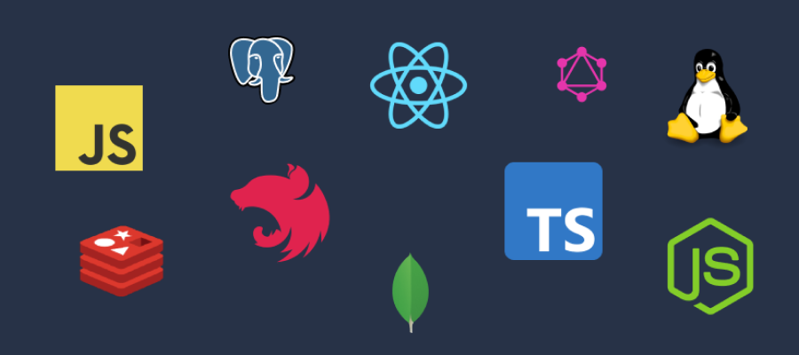

Welcome to my personal blog! I am beginner tech blogger and this is my first symbolic blog post. My blog's goals are simple - I just want my own space to share my knowledge and thoughts.

# Little bit about me
My name is Michał and I am 19yo from Poland. My hobbies are programming and  learning about history. I love metal music and dogs. I support open source software. I started with programming in 2018 - my first programming language was JavaScript.

# Reasons to blog
I do not think so I will achieve big audience for my blog. I just want small place to express myself.

Besides need of my own space I also want to level-up my english skills. I believe writing articles will help me in getting first job as software developer. Currently my english is quite poor but I hope you will see my progress with every new article.

Blogging also will push me to research new interesting topics - I do not want just create low effort content for beginners. I want to make some complex topics more accessible.

# Topics
Now let's talk about my content topics. As a future software developer I will write posts about things I love - *programming*, *FOSS*, *operating systems* and technology in general. To be more specific, I will write about web development, databases, Node.js and TypeScript stack.

# Future of blog
This website is under constant development. Current design of website (*v2*) is temporary. Yet before my first job I am planning to redesign blog and landing page. Code of website will be accessible on GitHub but under restrictions (no license - that means the work is under exclusive copyright by default).

I am planning to post some articles on my [dev.to](https://dev.to/michaldziuba "My dev.to profile").
