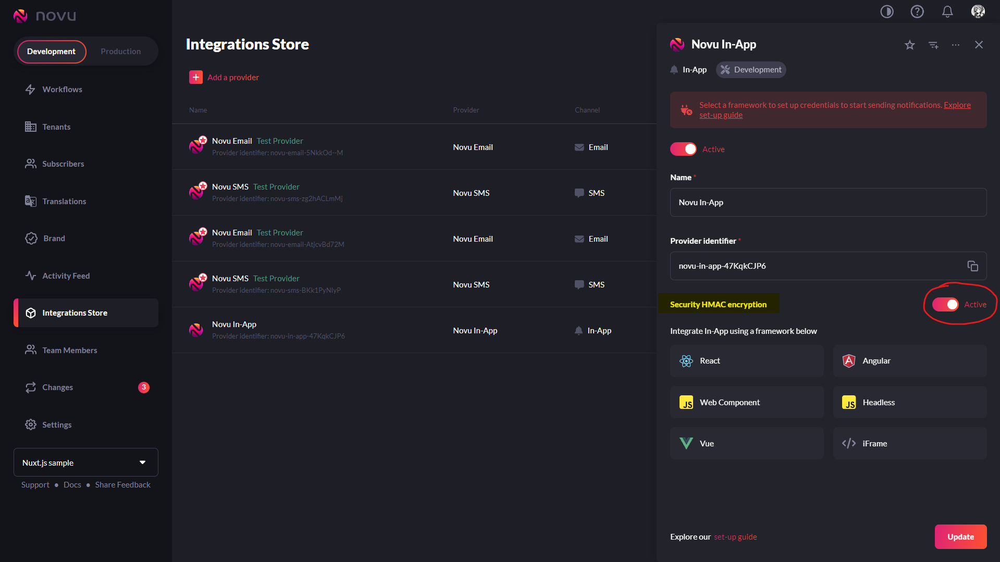

import { Image } from 'astro:assets';

> Note: Tutorial is outdated

### TL;DR

We will integrate Novu notification center with HMAC encryption enabled and then we will trigger notification in Nuxt.js using Novu SDK.
Full code is available in my [GitHub repository](https://github.com/michaldziuba03/code-samples/tree/main/novu-nuxt).

## Novu dashboard

Let's say you have defined Novu [workflow](https://docs.novu.co/workflows/notification-workflows). If you click "Trigger notification" button, you will find subscriberId of your test user.

In Novu, **Subscriber** is an entity that will receive notifications, so in real app you would use users from your database as [subscribers](https://docs.novu.co/subscribers/subscribers).


You can find credentials in "Settings" page. **Application ID** can be stored safely on client-side but **API Key** must be secret and stored on server-side only.


For security reasons - enable HMAC encryption for **Novu In-App** integration on "Integration Store" page.

HMAC encryption will make sure that a subscriberId is encrypted using the secret API key, and those will prevent malicious actors from impersonating users.




## Nuxt.js setup

Create a new Nuxt.js project by running the code snippet below:

```sh
npx nuxi@latest init app
```

Install Novu notification center integration for Vue.js:

```sh
npm install @novu/notification-center-vue
```

Create `.env` file and paste your values from Novu dashboard:

```sh
NOVU_SUBSRIBER_ID='<YOUR_SUBSCRIBER_ID>'
NOVU_API_KEY='<YOUR_NOVU_API_KEY>'
VITE_NOVU_APP_ID='<YOUR_NOVU_APP_ID>'
```

I use TailwindCSS for styling - you can find Nuxt.js configuration guide on official [Tailwind docs](https://tailwindcss.com/docs/guides/nuxtjs).

Now, define **client-side** plugin:

> plugins/novu.client.ts

```ts
import NotificationCenterPlugin from '@novu/notification-center-vue';
import '@novu/notification-center-vue/dist/style.css';

export default defineNuxtPlugin((nuxtApp) => {
  nuxtApp.vueApp.use(NotificationCenterPlugin);
});
```

> Nuxt.js automatically recognizes the .client.vue extension and ensures that the plugin is only included in the client-side bundle.

In the next step, we wrap Novu notification center in [client-side](https://nuxt.com/docs/guide/directory-structure/components#client-components) component.

We simulate request for user session data - we want to obtain subscriberId (user's id from database) and HMAC hash generated on the server.
We will add missing API endpoint handler later.

> components/NotificationCenter.client.vue

```vue
<script lang="ts" setup>

const { data, status } = await useAsyncData('session', () =>
  $fetch('/api/user')
)

const applicationIdentifier = import.meta.env.VITE_NOVU_APP_ID;
const sessionLoaded = () => {
  console.log('Notification center session loaded successfully!');
};

</script>
<template>
  <NotificationCenterComponent
    v-if="status == 'success' && data"
    v-slot="slot"
    :subscriber-id="data.userId"
    :subscriber-hash="data.hmacHash"
    :application-identifier="applicationIdentifier"
    :session-loaded="sessionLoaded"
  >
    <button 
      class="relative w-8 h-8 m-auto"
      :class="{'before:bg-red-700 before:w-2.5 before:h-2.5 before:rounded-full before:absolute before:top-0 before:right-0': slot.unseenCount > 0}"
      >
      <svg xmlns="http://www.w3.org/2000/svg" width="24" height="24" viewBox="0 0 24 24" fill="none" stroke="currentColor" stroke-width="2" stroke-linecap="round" stroke-linejoin="round">
        <path d="M6 8a6 6 0 0 1 12 0c0 7 3 9 3 9H3s3-2 3-9"/>
        <path d="M10.3 21a1.94 1.94 0 0 0 3.4 0"/>
      </svg>
    </button>
  </NotificationCenterComponent>
</template>
```

Now put our notification center component inside the header:

> Header.vue
```vue
<template>
<Container>
  <header class="w-full pt-6 lg:pt-8 flex gap-4 items-center justify-between">
    <h1 class="font-black text-lg">App</h1>
    <nav class="flex items-center gap-8 font-medium text-sm">
      <nuxt-link to="/">Home</nuxt-link>
      <nuxt-link to="/about">About</nuxt-link>
      <NotificationCenter />
    </nav>
  </header>
</Container>
</template>
```

> Container.vue
```vue
<template>
  <div class="px-6 mx-auto max-w-[1200px]">
    <slot />
  </div>
</template>
```

Create hero section with button to trigger notification:

> Trigger.vue
```vue
<script setup>
function triggerNotification() {
  fetch('/api/trigger', {
    method: 'POST',
    headers: {
      'Content-Type': 'application/json',
    },
  });
}
</script>

<template>
<Container>
  <div class="py-24 md:py-32 flex flex-col items-center">
    <a href="https://docs.novu.co/getting-started/send-your-first-notification"
      target="_blank"
      class="px-3 py-1 text-sm font-medium border border-[#e500c0] text-[#e500c0] rounded-full text-center mb-4">
      Check Novu docs 🚀
    </a>
    <h1 class="text-5xl md:text-6xl font-extrabold text-center">Trigger notification</h1>
    <p class="text-center text-slate-900 text-lg mt-4">
      Click the trigger button and then check the notification center by clicking the bell.
    </p>
    <div class="flex justify-center gap-4 mt-8">
      <button @click="triggerNotification" class="bg-black hover:bg-black/80 text-white font-medium px-8 py-3 rounded-md">Trigger</button>
    </div>
  </div>
</Container>
</template>
```

## Server-side integration

Install Novu Node.js SDK (**SDK** is intended for use exclusively in server-side):

```sh
npm install @novu/node
```

Now, add our missing API handlers:

> server/api/trigger

```ts
import { Novu } from '@novu/node';

const novu = new Novu({
  apiKey: process.env.NOVU_API_KEY,
});

export default defineEventHandler(async (event) => {
  console.log(`Received event: ${event}`);

  await novu.trigger('sample-workflow', {
    to: {
      subscriberId: process.env.NOVU_SUBSRIBER_ID!,
    },
    payload: {}
  });
});
```

Last step - encrypt subscriberId with HMAC and return user data. In real app you would fetch currently authenticated user from database.

> server/api/user

```ts
import { createHmac } from "crypto";

export default defineEventHandler(async (event) => {
  console.log(`Received event: ${event}`);

  const userId = process.env.NOVU_SUBSRIBER_ID!;

  const hmacHash = createHmac("sha256", process.env.NOVU_API_KEY!)
    .update(userId)
    .digest("hex");

  return {
    userId,
    hmacHash,
  }
});
```

## What next?

If you want to customize your notification center, there is [Novu Headless Library](https://docs.novu.co/guides/headless-notification-center-guide). Novu Headless is plain-JS library and it abstracts underlying real-time WebSocket events and REST API calls.

You can also define your workflows programatically (code-first approach), using Novu Echo. Echo supports Nuxt.js out of the box, so check it out: 

- [Novu Echo](https://docs.novu.co/echo/quickstart)
- [Novu Echo with Nuxt](https://docs.novu.co/echo/sdk/frameworks/nuxt)
- [How to send notifications with Nuxt.js and Vuemail](https://docs.novu.co/guides/echo-guides/echo-nuxt-vuemail)
